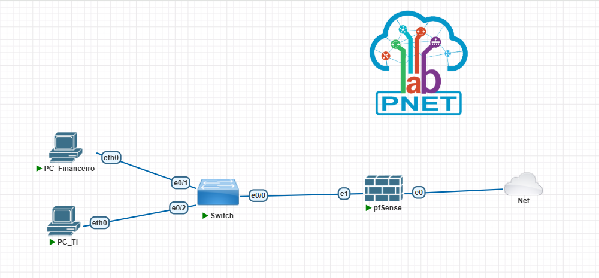

# Projeto de Redes – pfSense VLANs e Firewall

## Descrição
Este projeto foi desenvolvido para estudo e prática de redes utilizando **pfSense**. O foco principal é a configuração de **VLANs** e **regras básicas de firewall** para segmentação de rede e controle de tráfego entre setores de uma empresa fictícia.

---

## Topologia da Rede
A topologia foi criada no **PNETLab** e inclui:
- **pfSense** como firewall e gerenciador de VLANs  
- **Switch L2 gerenciável** para segmentação de VLANs  
- **Hosts/VPCs** conectados às VLANs  

### Endereços IP
| Interface            | Rede / IP           | Descrição                                             |
|----------------------|---------------------|-------------------------------------------------------|
| WAN                  | 192.168.0.7         | Conectado à rede real via bridge do Management Cloud  |
| LAN                  | 192.168.1.1         | Interface principal do pfSense                        |
| VLAN 10 (Financeiro) | 192.168.10.0/24     | Setor FINANCEIRO                                      |
| VLAN 20 (TI)         | 192.168.20.0/24     | Setor TI                                              |

> Cada VLAN está associada a uma interface virtual no pfSense. O tráfego das VLANs é controlado pelas regras de firewall.

> O arquivo do lab do PNETLab está disponível em `topologia/lab.zip`.

---

## Configuração do pfSense
Todas as configurações foram realizadas via **Web GUI**.

### Principais etapas
1. Criação das VLANs para segmentação de rede: LAN10 (FINANCEIRO) e LAN20 (TI)  
2. Configuração das interfaces VLAN no pfSense com os IPs correspondentes  
3. Criação de regras de firewall básicas para controlar o tráfego entre VLANs  
4. Teste de conectividade entre hosts de diferentes VLANs  

---

## Referência de configuração

Exemplo de passos:

1. Criar VLAN 10 → Interface LAN10 (192.168.10.1/24, FINANCEIRO)  
2. Criar VLAN 20 → Interface LAN20 (192.168.20.1/24, TI)  
3. Configurar IPs para cada VLAN  
4. Adicionar regras de firewall: permitir ou bloquear tráfego entre VLANs conforme necessidade  
5. Testar conectividade entre hosts

---

## Como reproduzir
1. Baixe o arquivo `topologia/LAB-VLANS-pfSense.unl` e importe no **PNETLab**  
2. Confira os prints em `prints/` para referência visual de como configurar no pfSense
3. Consulte os comandos e configurações na pasta `configs/`  
4. Teste a comunicação entre VLANs e o funcionamento das regras de firewall

---

## Observações
- Projeto focado em **aprendizado de segmentação de rede e regras básicas de firewall**  
- O acesso à Internet depende da WAN estar corretamente configurada (neste lab, a WAN está em bridge para a rede real via Management Cloud do PNETLab)  
- VLANs e endereços IP são fictícios e podem ser ajustados conforme a necessidade

---

## Autor
**Leandro Lima** – Estudante de Redes  

